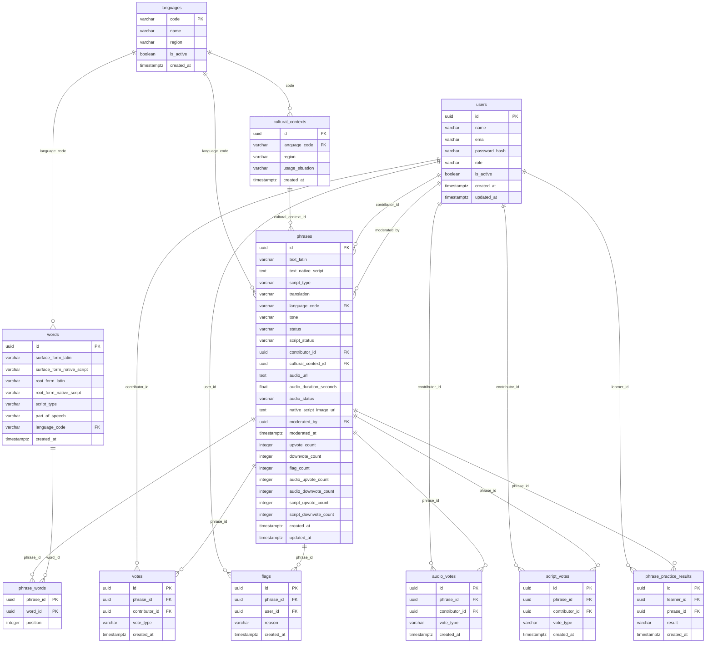

# ERD — Bahasa Daerah Learning Platform

```mermaid
erDiagram
    users {
        uuid id PK
        varchar name
        varchar email
        varchar password_hash
        varchar role
        boolean is_active
        timestamptz created_at
        timestamptz updated_at
    }

    languages {
        varchar code PK
        varchar name
        varchar region
        boolean is_active
        timestamptz created_at
    }

    cultural_contexts {
        uuid id PK
        varchar language_code FK
        varchar region
        varchar usage_situation
        timestamptz created_at
    }

    phrases {
        uuid id PK
        varchar text_latin
        text text_native_script
        varchar script_type
        varchar translation
        varchar language_code FK
        varchar tone
        varchar status
        varchar script_status
        uuid contributor_id FK
        uuid cultural_context_id FK
        text audio_url
        float audio_duration_seconds
        varchar audio_status
        text native_script_image_url
        uuid moderated_by FK
        timestamptz moderated_at
        integer upvote_count
        integer downvote_count
        integer flag_count
        integer audio_upvote_count
        integer audio_downvote_count
        integer script_upvote_count
        integer script_downvote_count
        timestamptz created_at
        timestamptz updated_at
    }

    words {
        uuid id PK
        varchar surface_form_latin
        varchar surface_form_native_script
        varchar root_form_latin
        varchar root_form_native_script
        varchar script_type
        varchar part_of_speech
        varchar language_code FK
        timestamptz created_at
    }

    phrase_words {
        uuid phrase_id PK
        uuid word_id PK
        integer position
    }

    votes {
        uuid id PK
        uuid phrase_id FK
        uuid contributor_id FK
        varchar vote_type
        timestamptz created_at
    }

    flags {
        uuid id PK
        uuid phrase_id FK
        uuid user_id FK
        varchar reason
        timestamptz created_at
    }

    audio_votes {
        uuid id PK
        uuid phrase_id FK
        uuid contributor_id FK
        varchar vote_type
        timestamptz created_at
    }

    script_votes {
        uuid id PK
        uuid phrase_id FK
        uuid contributor_id FK
        varchar vote_type
        timestamptz created_at
    }

    phrase_practice_results {
        uuid id PK
        uuid learner_id FK
        uuid phrase_id FK
        varchar result
        timestamptz created_at
    }

    languages ||--o{ cultural_contexts : "code"
    languages ||--o{ phrases : "language_code"
    languages ||--o{ words : "language_code"

    cultural_contexts ||--o{ phrases : "cultural_context_id"

    users ||--o{ phrases : "contributor_id"
    users ||--o{ phrases : "moderated_by"
    users ||--o{ votes : "contributor_id"
    users ||--o{ flags : "user_id"
    users ||--o{ audio_votes : "contributor_id"
    users ||--o{ script_votes : "contributor_id"
    users ||--o{ phrase_practice_results : "learner_id"

    phrases ||--o{ phrase_words : "phrase_id"
    phrases ||--o{ votes : "phrase_id"
    phrases ||--o{ flags : "phrase_id"
    phrases ||--o{ audio_votes : "phrase_id"
    phrases ||--o{ script_votes : "phrase_id"
    phrases ||--o{ phrase_practice_results : "phrase_id"

    words ||--o{ phrase_words : "word_id"
```
